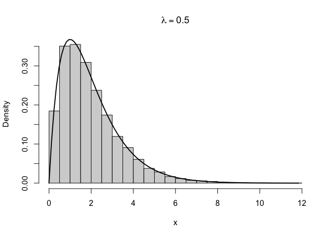
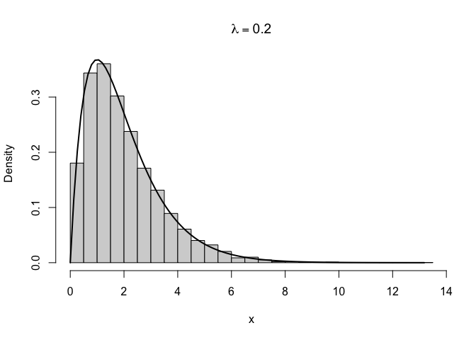

# HW2 Q3(c) code


## Question 3(c)

``` r
set.seed(123)
N <- 10^4
```

lambda = 0.5

``` r
lambda <- 0.5
c <- 4 / exp(1)

samples1 <- numeric(N) # create a vector to store the accepted samples
accepted <- 0
proposed <- 0

start_time <- proc.time()[3]

while (accepted < N) {
  
  # sample from Exp(lambda) by inversion
  V <- runif(1)
  X <- -log(V) / lambda
  
  proposed <- proposed + 1
  
  # rejection sampling acceptance probability
  U <- runif(1)
  accept_prob <- exp(1) * (1 - lambda) * X *
                 exp(-(1 - lambda) * X)
  
  if (U < accept_prob) {
    accepted <- accepted + 1
    samples1[accepted] <- X
  }
}

elapsed <- proc.time()[3] - start_time

acceptance1 <- N / proposed
theoretical1 <- 1 / c
time_per_sample1 <- elapsed / N

acceptance1
```

    [1] 0.6830135

``` r
theoretical1
```

    [1] 0.6795705

``` r
time_per_sample1
```

    elapsed 
    1.2e-06 

``` r
hist(samples1,
     probability = TRUE,
     breaks = 40,
     main = expression(lambda == 0.5),
     xlab = "x")

curve(x * exp(-x),
      from = 0,
      to = max(samples1),
      add = TRUE,
      lwd = 2)
```



Lambda = 0.2

``` r
lambda <- 0.2
c <- 1 / (0.16 * exp(1))

samples2 <- numeric(N)
accepted <- 0
proposed <- 0

start_time <- proc.time()[3]

while (accepted < N) {
  
  V <- runif(1)
  X <- -log(V) / lambda
  
  proposed <- proposed + 1
  
  U <- runif(1)
  accept_prob <- exp(1) * (1 - lambda) * X *
                 exp(-(1 - lambda) * X)
  
  if (U < accept_prob) {
    accepted <- accepted + 1
    samples2[accepted] <- X
  }
}

elapsed <- proc.time()[3] - start_time

acceptance2 <- N / proposed
theoretical2 <- 1 / c
time_per_sample2 <- elapsed / N

acceptance2
```

    [1] 0.4285225

``` r
theoretical2
```

    [1] 0.4349251

``` r
time_per_sample2
```

    elapsed 
    1.8e-06 

``` r
hist(samples2,
     probability = TRUE,
     breaks = 40,
     main = expression(lambda == 0.2),
     xlab = "x")

curve(x * exp(-x),
      from = 0,
      to = max(samples2),
      add = TRUE,
      lwd = 2)
```



Both histograms are similar to the target density (f(x)=xe^{-x}),
indicating that the rejection sampler is producing the correct
distribution. For (), the empirical acceptance fraction is close to the
theoretical value (e/4). For (), the theoretical acceptance fraction
decreases to approximately (0.435). The () requires substantially more
proposals per accepted sample and tends to have a larger mean
computation time per accepted sample. The proposal with () is more
efficient.
