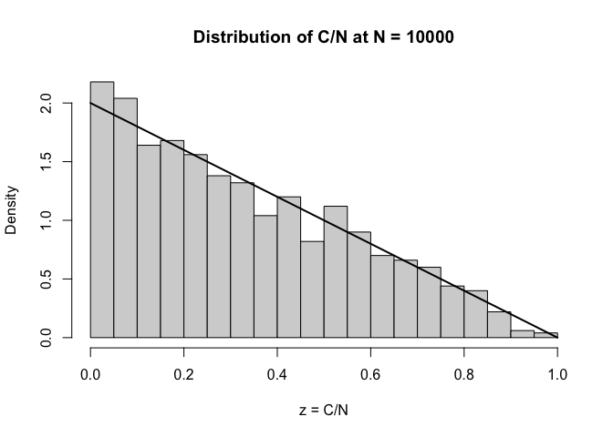

# hw2_5c


``` r
set.seed(123)

R <- 1000
Nmax <- 1e4

# Initial condition: C(3) = 1 for every realization
C <- rep(1, R)

# Grow from N = 3 up to N = 10000
for (N in 3:(Nmax - 1)) {

  # Probability of increment for each realization
  p <- C / N

  # One length-R vector of Bernoulli draws
  increments <- rbinom(R, size = 1, prob = p)

  # Update all realizations simultaneously
  C <- C + increments
}

# Final normalized core fraction
z <- C / Nmax
```

``` r
# Theoretical values from part (a)
theory_mean <- 1/3
theory_var <- 1/18
theory_sd_mean_ratio <- sqrt(theory_var) / theory_mean

# Empirical values
emp_mean <- mean(z)
emp_sd_mean_ratio <- sd(z) / mean(z)

# Smallest and largest core sizes observed
min_core <- min(C)
max_core <- max(C)

cat("Theoretical mean:", theory_mean, "\n")
```

    Theoretical mean: 0.3333333 

``` r
cat("Empirical mean:", emp_mean, "\n\n")
```

    Empirical mean: 0.3263688 

``` r
cat("Theoretical SD/mean ratio:", theory_sd_mean_ratio, "\n")
```

    Theoretical SD/mean ratio: 0.7071068 

``` r
cat("Empirical SD/mean ratio:", emp_sd_mean_ratio, "\n\n")
```

    Empirical SD/mean ratio: 0.7241625 

``` r
cat("Smallest core:", min_core, "\n")
```

    Smallest core: 2 

``` r
cat("Largest core:", max_core, "\n")
```

    Largest core: 9540 

``` r
hist(z,
     probability = TRUE,
     breaks = 30,
     xlim = c(0, 1),
     main = "Distribution of C/N at N = 10000",
     xlab = "z = C/N")

curve(2 * (1 - x),
      from = 0, to = 1,
      add = TRUE,
      lwd = 2)
```



The average normalized core size is close to 1/3, as the limiting
distribution predicts. However, the relatively large CV shows that
individual networks can have core sizes far from the average, so the
mean alone can’t represent a typical single realization.
