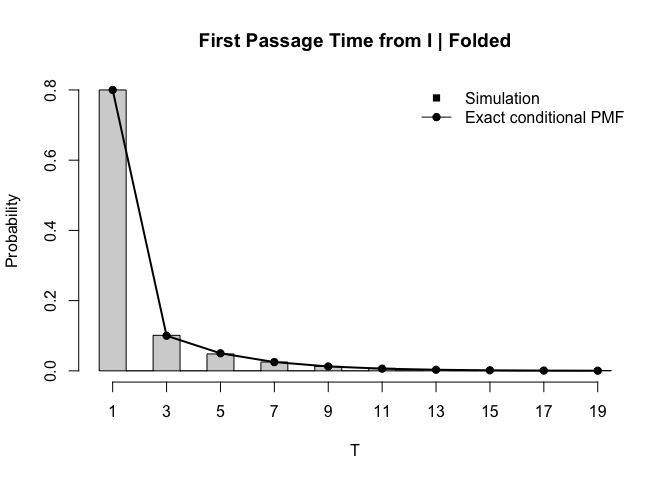
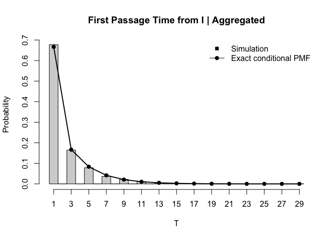

# HW4 Q4 c


Transition matrix:

``` r
set.seed(123)

# State order: U, I, M, F, A
states <- c("U", "I", "M", "F", "A")

P <- matrix(
  c(
    0,   1/2, 1/2, 0,   0,    # U
    1/4, 0,   0,   1/2, 1/4,  # I
    3/4, 0,   0,   0,   1/4,  # M
    0,   0,   0,   1,   0,    # F
    0,   0,   0,   0,   1     # A
  ),
  nrow = 5,
  byrow = TRUE,
  dimnames = list(states, states)
)

P
```

         U   I   M   F    A
    U 0.00 0.5 0.5 0.0 0.00
    I 0.25 0.0 0.0 0.5 0.25
    M 0.75 0.0 0.0 0.0 0.25
    F 0.00 0.0 0.0 1.0 0.00
    A 0.00 0.0 0.0 0.0 1.00

1.  Discrete inverse transform

``` r
# One step using discrete inverse transform

draw_next_state <- function(current_state, P) {
  
  probs <- P[current_state, ]
  cum_probs <- cumsum(probs)
  
  u <- runif(1)
  
  next_index <- which(u <= cum_probs)[1]
  next_state <- colnames(P)[next_index]
  
  return(next_state)
}

# Simulate one chain until absorption

simulate_one_chain <- function(start_state, P) {
  
  current_state <- start_state
  T <- 0
  
  while (!(current_state %in% c("F", "A"))) {
    
    current_state <- draw_next_state(current_state, P)
    T <- T + 1
    
  }
  
  return(c(T = T, fate = current_state))
}
```

Simulate $10^4$ chains from U, I, M

``` r
Nsim <- 1e4

simulate_many <- function(start_state, Nsim, P) {
  
  out <- replicate(
    Nsim,
    simulate_one_chain(start_state, P)
  )
  
  data.frame(
    start = start_state,
    T = as.numeric(out["T", ]),
    fate = out["fate", ]
  )
}


sim_U <- simulate_many("U", Nsim, P)
sim_I <- simulate_many("I", Nsim, P)
sim_M <- simulate_many("M", Nsim, P)

sim_all <- rbind(sim_U, sim_I, sim_M)

head(sim_all)
```

      start T fate
    1     U 2    A
    2     U 2    A
    3     U 4    A
    4     U 8    A
    5     U 4    A
    6     U 4    A

Compute simulation estimates:

``` r
get_estimates <- function(dat) {
  
  c(
    h_hat = mean(dat$fate == "F"),
    g_hat = mean(dat$T),
    tau_F_hat = mean(dat$T[dat$fate == "F"]),
    tau_A_hat = mean(dat$T[dat$fate == "A"])
  )
}


estimates <- rbind(
  U = get_estimates(sim_U),
  I = get_estimates(sim_I),
  M = get_estimates(sim_M)
)

estimates
```

       h_hat  g_hat tau_F_hat tau_A_hat
    U 0.5115 4.0096  3.984751  4.035619
    I 0.6190 1.9856  1.795800  2.293963
    M 0.3717 4.0146  5.015066  3.422728

Compare simulation to exact values:

``` r
exact <- data.frame(
  start = c("U", "I", "M"),
  
  h_exact = c(
    1/2,
    5/8,
    3/8
  ),
  
  g_exact = c(
    4,
    2,
    4
  ),
  
  tau_F_exact = c(
    4,
    9/5,
    5
  ),
  
  tau_A_exact = c(
    4,
    7/3,
    17/5
  )
)


simulation <- data.frame(
  start = rownames(estimates),
  h_hat = estimates[, "h_hat"],
  g_hat = estimates[, "g_hat"],
  tau_F_hat = estimates[, "tau_F_hat"],
  tau_A_hat = estimates[, "tau_A_hat"]
)


comparison <- merge(exact, simulation, by = "start")

comparison <- comparison[
  match(c("U", "I", "M"), comparison$start),
]

comparison
```

      start h_exact g_exact tau_F_exact tau_A_exact  h_hat  g_hat tau_F_hat
    3     U   0.500       4         4.0    4.000000 0.5115 4.0096  3.984751
    1     I   0.625       2         1.8    2.333333 0.6190 1.9856  1.795800
    2     M   0.375       4         5.0    3.400000 0.3717 4.0146  5.015066
      tau_A_hat
    3  4.035619
    1  2.293963
    2  3.422728

Extract Q and R:

``` r
Q <- P[c("U", "I", "M"),
       c("U", "I", "M")]

R <- P[c("U", "I", "M"),
       c("F", "A")]

Q
```

         U   I   M
    U 0.00 0.5 0.5
    I 0.25 0.0 0.0
    M 0.75 0.0 0.0

``` r
R
```

        F    A
    U 0.0 0.00
    I 0.5 0.25
    M 0.0 0.25

Exact PMF of T starting from I:

``` r
max_n <- max(sim_I$T)

# Starting distribution: start exactly at I
v <- c(U = 0, I = 1, M = 0)

pmf_joint_F <- numeric(max_n)
pmf_joint_A <- numeric(max_n)

for (n in 1:max_n) {
  
  # v currently equals e_I Q^(n-1)
  absorption_prob <- as.numeric(v %*% R)
  
  pmf_joint_F[n] <- absorption_prob[1]
  pmf_joint_A[n] <- absorption_prob[2]
  
  # Move one more step among transient states
  v <- as.numeric(v %*% Q)
  names(v) <- c("U", "I", "M")
}


# P_I(F) = h_I = 5/8
# P_I(A) = 1 - h_I = 3/8

h_I <- 5/8

pmf_F <- pmf_joint_F / h_I
pmf_A <- pmf_joint_A / (1 - h_I)


exact_pmf <- data.frame(
  n = 1:max_n,
  P_T_given_F = pmf_F,
  P_T_given_A = pmf_A
)

exact_pmf
```

        n  P_T_given_F  P_T_given_A
    1   1 8.000000e-01 6.666667e-01
    2   2 0.000000e+00 0.000000e+00
    3   3 1.000000e-01 1.666667e-01
    4   4 0.000000e+00 0.000000e+00
    5   5 5.000000e-02 8.333333e-02
    6   6 0.000000e+00 0.000000e+00
    7   7 2.500000e-02 4.166667e-02
    8   8 0.000000e+00 0.000000e+00
    9   9 1.250000e-02 2.083333e-02
    10 10 0.000000e+00 0.000000e+00
    11 11 6.250000e-03 1.041667e-02
    12 12 0.000000e+00 0.000000e+00
    13 13 3.125000e-03 5.208333e-03
    14 14 0.000000e+00 0.000000e+00
    15 15 1.562500e-03 2.604167e-03
    16 16 0.000000e+00 0.000000e+00
    17 17 7.812500e-04 1.302083e-03
    18 18 0.000000e+00 0.000000e+00
    19 19 3.906250e-04 6.510417e-04
    20 20 0.000000e+00 0.000000e+00
    21 21 1.953125e-04 3.255208e-04
    22 22 0.000000e+00 0.000000e+00
    23 23 9.765625e-05 1.627604e-04
    24 24 0.000000e+00 0.000000e+00
    25 25 4.882813e-05 8.138021e-05
    26 26 0.000000e+00 0.000000e+00
    27 27 2.441406e-05 4.069010e-05
    28 28 0.000000e+00 0.000000e+00
    29 29 1.220703e-05 2.034505e-05

``` r
exact_pmf[exact_pmf$P_T_given_F > 0, ]
```

        n  P_T_given_F  P_T_given_A
    1   1 8.000000e-01 6.666667e-01
    3   3 1.000000e-01 1.666667e-01
    5   5 5.000000e-02 8.333333e-02
    7   7 2.500000e-02 4.166667e-02
    9   9 1.250000e-02 2.083333e-02
    11 11 6.250000e-03 1.041667e-02
    13 13 3.125000e-03 5.208333e-03
    15 15 1.562500e-03 2.604167e-03
    17 17 7.812500e-04 1.302083e-03
    19 19 3.906250e-04 6.510417e-04
    21 21 1.953125e-04 3.255208e-04
    23 23 9.765625e-05 1.627604e-04
    25 25 4.882813e-05 8.138021e-05
    27 27 2.441406e-05 4.069010e-05
    29 29 1.220703e-05 2.034505e-05

``` r
I_fold <- sim_I$T[sim_I$fate == "F"]
I_agg  <- sim_I$T[sim_I$fate == "A"]
```

Histogram: folded runs

``` r
max_fold <- max(I_fold)

hist(
  I_fold,
  breaks = seq(0.5, max_fold + 0.5, by = 1),
  probability = TRUE,
  main = "First Passage Time from I | Folded",
  xlab = "T",
  ylab = "Probability",
  xaxt = "n"
)

axis(
  1,
  at = seq(1, max_fold, by = 2)
)

n_fold <- seq(1, max_fold, by = 2)

points(
  n_fold,
  pmf_F[n_fold],
  pch = 19
)

lines(
  n_fold,
  pmf_F[n_fold],
  lwd = 2
)

legend(
  "topright",
  legend = c("Simulation", "Exact conditional PMF"),
  lty = c(NA, 1),
  pch = c(15, 19),
  bty = "n"
)
```



Histogram: aggregated runs

``` r
max_agg <- max(I_agg)

hist(
  I_agg,
  breaks = seq(0.5, max_agg + 0.5, by = 1),
  probability = TRUE,
  main = "First Passage Time from I | Aggregated",
  xlab = "T",
  ylab = "Probability",
  xaxt = "n"
)

axis(
  1,
  at = seq(1, max_agg, by = 2)
)

n_agg <- seq(1, max_agg, by = 2)

points(
  n_agg,
  pmf_A[n_agg],
  pch = 19
)

lines(
  n_agg,
  pmf_A[n_agg],
  lwd = 2
)

legend(
  "topright",
  legend = c("Simulation", "Exact conditional PMF"),
  lty = c(NA, 1),
  pch = c(15, 19),
  bty = "n"
)
```


