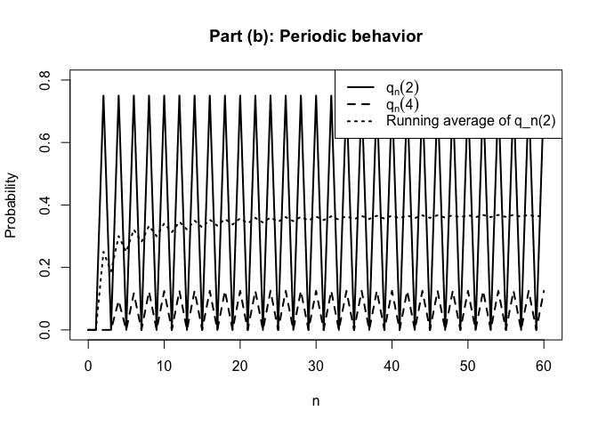
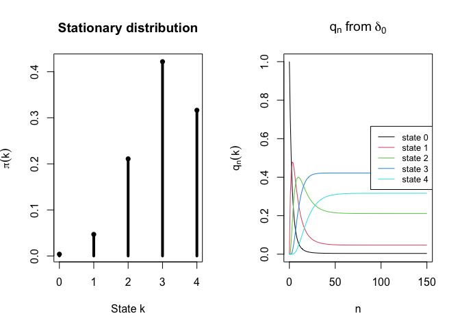
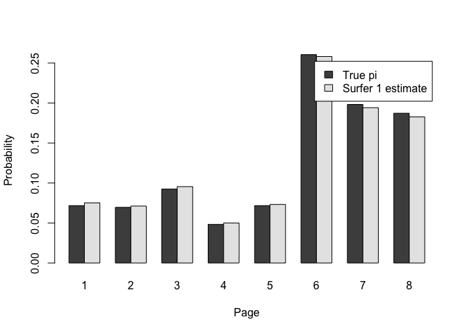
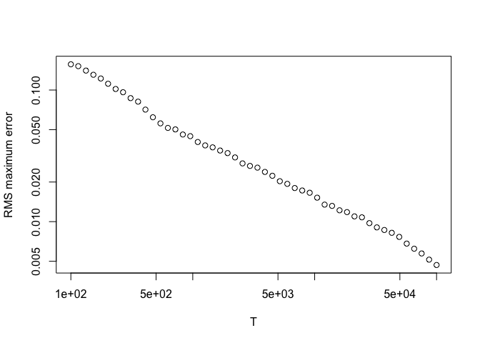
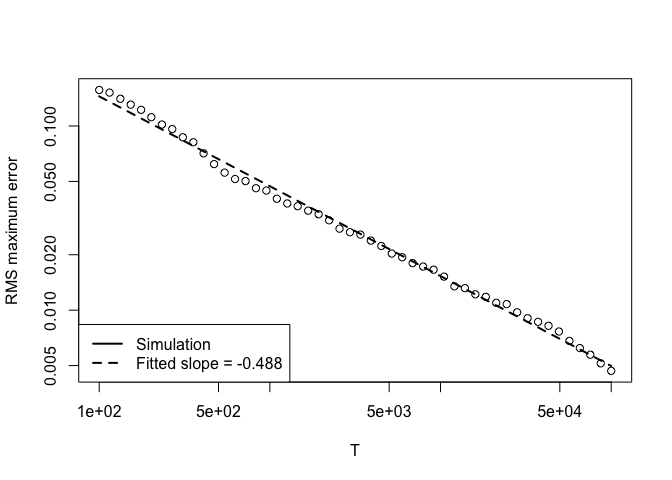

# HW5


## Problem 1 (b)

``` r
# Part (b)
# a = b = 1, q0 = delta_0

a <- 1
b <- 1

# States: 0,1,2,3,4
states <- 0:4

# Build transition matrix P
P <- matrix(0, nrow = 5, ncol = 5)

for (k in states) {

  # k -> k+1
  if (k < 4) {
    P[k + 1, k + 2] <- a * (4 - k) / 4
  }

  # k -> k-1
  if (k > 0) {
    P[k + 1, k] <- b * k / 4
  }

  # k -> k
  P[k + 1, k + 1] <- 1 - sum(P[k + 1, ])
}

P
```

         [,1] [,2] [,3] [,4] [,5]
    [1,] 0.00  1.0 0.00  0.0 0.00
    [2,] 0.25  0.0 0.75  0.0 0.00
    [3,] 0.00  0.5 0.00  0.5 0.00
    [4,] 0.00  0.0 0.75  0.0 0.25
    [5,] 0.00  0.0 0.00  1.0 0.00

``` r
# q0 = delta_0
q0 <- c(1, 0, 0, 0, 0)

# Store q_n for n = 0,...,60
q <- matrix(NA, nrow = 61, ncol = 5)
q[1, ] <- q0

for (n in 1:60) {
  q[n + 1, ] <- q[n, ] %*% P
}

colnames(q) <- paste0("state_", 0:4)
rownames(q) <- 0:60
```

``` r
q50 <- q[51, ]
q51 <- q[52, ]

q50
```

    state_0 state_1 state_2 state_3 state_4 
      0.125   0.000   0.750   0.000   0.125 

``` r
q51
```

    state_0 state_1 state_2 state_3 state_4 
        0.0     0.5     0.0     0.5     0.0 

``` r
n_vals <- 0:60

q2 <- q[, 3]   # q_n(2)
q4 <- q[, 5]   # q_n(4)


running_avg_q2 <- cumsum(q2) / (n_vals + 1)
```

``` r
plot(
  n_vals, q2,
  type = "l",
  lwd = 2,
  ylim = c(0, 0.8),
  xlab = "n",
  ylab = "Probability",
  main = "Part (b): Periodic behavior"
)

lines(n_vals, q4, lwd = 2, lty = 2)
lines(n_vals, running_avg_q2, lwd = 2, lty = 3)

legend(
  "topright",
  legend = c(
    expression(q[n](2)),
    expression(q[n](4)),
    "Running average of q_n(2)"
  ),
  lty = c(1, 2, 3),
  lwd = 2
)
```



## Problem 1 (c)

``` r
a <- 0.3
b <- 0.1
states <- 0:4

# transition matrix P
P <- matrix(0, nrow = 5, ncol = 5)

for (k in states) {
  if (k < 4) {
    P[k + 1, k + 2] <- a * (4 - k) / 4
  }

  if (k > 0) {
    P[k + 1, k] <- b * k / 4
  }

  P[k + 1, k + 1] <- 1 - sum(P[k + 1, ])
}

P
```

          [,1] [,2]  [,3] [,4]  [,5]
    [1,] 0.700 0.30 0.000 0.00 0.000
    [2,] 0.025 0.75 0.225 0.00 0.000
    [3,] 0.000 0.05 0.800 0.15 0.000
    [4,] 0.000 0.00 0.075 0.85 0.075
    [5,] 0.000 0.00 0.000 0.10 0.900

``` r
A <- t(P) - diag(5)
A[5, ] <- rep(1, 5)

rhs <- c(0, 0, 0, 0, 1)

pi_num <- solve(A, rhs)
pi_num
```

    [1] 0.00390625 0.04687500 0.21093750 0.42187500 0.31640625

``` r
q <- c(1, 0, 0, 0, 0)

max_diff <- max(abs(q - pi_num))
n <- 0

while (max_diff >= 1e-6) {
  q <- as.vector(q %*% P)
  n <- n + 1
  max_diff <- max(abs(q - pi_num))
}

n
```

    [1] 134

``` r
max_diff
```

    [1] 9.349776e-07

``` r
q
```

    [1] 0.003906285 0.046875277 0.210938123 0.421875000 0.316405315

``` r
eig <- eigen(P)$values

eig
```

    [1] 1.0 0.9 0.8 0.7 0.6

``` r
sort(Mod(eig), decreasing = TRUE)
```

    [1] 1.0 0.9 0.8 0.7 0.6

``` r
# Store q_n for plotting
N <- 150

q_mat <- matrix(NA, nrow = N + 1, ncol = 5)
q_mat[1, ] <- c(1, 0, 0, 0, 0)

for (n in 1:N) {
  q_mat[n + 1, ] <- q_mat[n, ] %*% P
}

par(mfrow = c(1, 2))

# Panel 1: stationary distribution
plot(
  0:4, pi_num,
  type = "h",
  lwd = 4,
  xlab = "State k",
  ylab = expression(pi(k)),
  main = "Stationary distribution"
)
points(0:4, pi_num, pch = 16)

# Panel 2: q_n from delta_0
matplot(
  0:N, q_mat,
  type = "l",
  lty = 1,
  xlab = "n",
  ylab = expression(q[n](k)),
  main = expression(q[n]~"from"~delta[0])
)

legend(
  "right",
  legend = paste("state", 0:4),
  lty = 1,
  col = 1:5,
  cex = 0.8
)
```



## Problem 3 (a)

``` r
P <- matrix(0, 8, 8)

P[1, c(2,3)] <- 1/2
P[2, c(3,4)] <- 1/2
P[3, c(1,5)] <- 1/2
P[4, c(1,3,5)] <- 1/3
P[5, c(2,6,7)] <- 1/3
P[6, 6] <- 1
P[7, 8] <- 1
P[8, 7] <- 1

P
```

              [,1]      [,2]      [,3] [,4]      [,5]      [,6]      [,7] [,8]
    [1,] 0.0000000 0.5000000 0.5000000  0.0 0.0000000 0.0000000 0.0000000    0
    [2,] 0.0000000 0.0000000 0.5000000  0.5 0.0000000 0.0000000 0.0000000    0
    [3,] 0.5000000 0.0000000 0.0000000  0.0 0.5000000 0.0000000 0.0000000    0
    [4,] 0.3333333 0.0000000 0.3333333  0.0 0.3333333 0.0000000 0.0000000    0
    [5,] 0.0000000 0.3333333 0.0000000  0.0 0.0000000 0.3333333 0.3333333    0
    [6,] 0.0000000 0.0000000 0.0000000  0.0 0.0000000 1.0000000 0.0000000    0
    [7,] 0.0000000 0.0000000 0.0000000  0.0 0.0000000 0.0000000 0.0000000    1
    [8,] 0.0000000 0.0000000 0.0000000  0.0 0.0000000 0.0000000 1.0000000    0

``` r
q0 <- rep(1/8, 8)

q <- q0

q_all <- matrix(NA, 102, 8)
q_all[1, ] <- q0

for (n in 1:101) {
  q <- q %*% P
  q_all[n + 1, ] <- q
}

q100 <- q_all[101, ]
q101 <- q_all[102, ]

q100
```

    [1] 5.352014e-08 5.166001e-08 7.246627e-08 2.991872e-08 5.352014e-08
    [6] 4.374999e-01 2.677364e-01 2.947634e-01

``` r
q101
```

    [1] 4.620604e-08 4.460011e-08 6.256298e-08 2.583000e-08 4.620604e-08
    [6] 4.374999e-01 2.947635e-01 2.677364e-01

## Problem 3 (b)

``` r
d <- 0.85

G <- d * P + (1 - d)/8 * matrix(1, 8, 8)

G
```

              [,1]      [,2]      [,3]    [,4]      [,5]      [,6]      [,7]
    [1,] 0.0187500 0.4437500 0.4437500 0.01875 0.0187500 0.0187500 0.0187500
    [2,] 0.0187500 0.0187500 0.4437500 0.44375 0.0187500 0.0187500 0.0187500
    [3,] 0.4437500 0.0187500 0.0187500 0.01875 0.4437500 0.0187500 0.0187500
    [4,] 0.3020833 0.0187500 0.3020833 0.01875 0.3020833 0.0187500 0.0187500
    [5,] 0.0187500 0.3020833 0.0187500 0.01875 0.0187500 0.3020833 0.3020833
    [6,] 0.0187500 0.0187500 0.0187500 0.01875 0.0187500 0.8687500 0.0187500
    [7,] 0.0187500 0.0187500 0.0187500 0.01875 0.0187500 0.0187500 0.0187500
    [8,] 0.0187500 0.0187500 0.0187500 0.01875 0.0187500 0.0187500 0.8687500
            [,8]
    [1,] 0.01875
    [2,] 0.01875
    [3,] 0.01875
    [4,] 0.01875
    [5,] 0.01875
    [6,] 0.01875
    [7,] 0.86875
    [8,] 0.01875

Iteration method:

``` r
q <- rep(1/8, 8)
iter <- 0
repeat {
  q_new <- as.vector(q %*% G)
  iter <- iter + 1

  if (sum(abs(q_new - q)) < 1e-10) {
    break
  }

  q <- q_new
}

pi_power <- q_new

iter
```

    [1] 124

``` r
pi_power
```

    [1] 0.07175665 0.06957763 0.09250788 0.04832049 0.07175665 0.26054035 0.19826505
    [8] 0.18727529

linear solve:

``` r
A <- t(G) - diag(8)

A[8, ] <- rep(1, 8)

rhs <- c(rep(0, 7), 1)

pi_solve <- solve(A, rhs)

pi_solve
```

    [1] 0.07175665 0.06957763 0.09250788 0.04832049 0.07175665 0.26054035 0.19826505
    [8] 0.18727529

``` r
max(abs(pi_solve - pi_power))
```

    [1] 2.197842e-11

Ranking:

``` r
order(pi_power, decreasing = TRUE)
```

    [1] 6 7 8 3 1 5 2 4

``` r
sort(pi_power, decreasing = TRUE)
```

    [1] 0.26054035 0.19826505 0.18727529 0.09250788 0.07175665 0.07175665 0.06957763
    [8] 0.04832049

# Problem 3 (c)

Construct the cumulative transition probabilities:

``` r
cumG <- t(apply(G, 1, cumsum))
```

``` r
set.seed(123)

R <- 100
Tmax <- 1e5

state <- rep(1L, R)
counts <- matrix(0, nrow = R, ncol = 8)

T_grid <- unique(round(10^seq(2, 5, length.out = 50)))
err_store <- matrix(NA, nrow = length(T_grid), ncol = R)

g <- 1

for (t in 1:Tmax) {

  u <- runif(R)

  probs <- cumG[state, , drop = FALSE]

  state <- 1L + rowSums(probs < u)

  counts[cbind(1:R, state)] <-
    counts[cbind(1:R, state)] + 1

  if (g <= length(T_grid) && t == T_grid[g]) {

    phat <- counts / t

    err_store[g, ] <-
      apply(
        abs(
          phat -
            matrix(pi_power, nrow = R, ncol = 8, byrow = TRUE)
        ),
        1,
        max
      )

    g <- g + 1
  }
}
```

``` r
pi_hat <- counts / Tmax
pi_hat_1 <- pi_hat[1, ]

pi_hat_1
```

    [1] 0.07511 0.07122 0.09548 0.05004 0.07319 0.25814 0.19417 0.18265

``` r
pi_power
```

    [1] 0.07175665 0.06957763 0.09250788 0.04832049 0.07175665 0.26054035 0.19826505
    [8] 0.18727529

``` r
barplot(
  rbind(pi_power, pi_hat_1),
  beside = TRUE,
  names.arg = 1:8,
  xlab = "Page",
  ylab = "Probability",
  legend.text = c("True pi", "Surfer 1 estimate")
)
```



``` r
rms_error <- sqrt(rowMeans(err_store^2))
plot(
  T_grid,
  rms_error,
  log = "xy",
  type = "b",
  xlab = "T",
  ylab = "RMS maximum error"
)
```



``` r
fit <- lm(log(rms_error) ~ log(T_grid))

slope <- coef(fit)[2]
slope
```

    log(T_grid) 
      -0.487881 

``` r
plot(
  T_grid,
  rms_error,
  log = "xy",
  type = "b",
  xlab = "T",
  ylab = "RMS maximum error"
)

lines(
  T_grid,
  exp(predict(fit)),
  lty = 2,
  lwd = 2
)

legend(
  "bottomleft",
  legend = c(
    "Simulation",
    paste0("Fitted slope = ", round(slope, 3))
  ),
  lty = c(1, 2),
  lwd = 2
)
```


